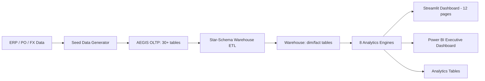

# AEGIS — Adaptive Engine for Global Intelligent Sourcing

> **Investment-grade procurement intelligence platform** — 40+ table normalized schema, 8 analytics engines, 12-page interactive dashboard, Monte Carlo simulation, ESG/carbon tracking, and enterprise-ready deployment.

---

## Business Problem

Global procurement teams face compounding risks from FX volatility, single-source concentration, ESG compliance gaps, and opaque cost structures. Without a unified analytics layer, organizations cannot quantify supplier risk, model disruption scenarios, or benchmark should-cost against actual spend. AEGIS solves this by delivering a fully integrated procurement intelligence stack — from normalized OLTP through star-schema warehouse to investor-grade analytics and real-time dashboards — enabling data-driven sourcing decisions at board level.

## AEGIS Capabilities

- Multi-Criteria Supplier Scoring (TOPSIS, PROMETHEE-II, WSM)
- 7-Dimension Composite Risk Scoring
- Monte Carlo Simulation (FX, Lead-Time, Disruption, Cost)
- Carbon Footprint Tracking (GHG Protocol Scope 3, GLEC Framework)
- Spend Concentration Analysis (HHI across 5 dimensions)
- Should-Cost Modelling with Automated Leakage Detection
- Working Capital & Early Payment Discount Optimization
- Scenario Planning (Supplier Switch, Currency Hedge, Nearshoring)
- ESG Compliance & OECD 6-Step Due Diligence Tracking
- Interactive 12-Page Streamlit Dashboard

## Architecture Diagram



## Data Model

AEGIS uses a three-layer architecture: normalized OLTP, star-schema warehouse, and analytics output tables.

- **OLTP Layer:** suppliers, materials, purchase_orders, po_line_items, shipments, invoices, quality_inspections, quality_incidents, contracts, fx_rates, commodity_prices, esg_assessments, carbon_estimates, compliance_checks, due_diligence_records (30+ tables)
- **Warehouse Layer:** `dim_date`, `dim_supplier` (SCD Type 2), `dim_material`, `dim_geography`, `fact_procurement`, `fact_esg`
- **Analytics Layer:** `supplier_scorecards`, `risk_assessments`, `concentration_analysis`, `simulation_runs`
- **Reference:** 15 countries, 10 currencies, 12 ports, 7 incoterms, emission factors, certifications catalog

## Risk Score Formula

Composite Supplier Risk (7 dimensions):

$$
\text{Risk} = w_1 \cdot \text{Financial} + w_2 \cdot \text{Operational} + w_3 \cdot \text{Geopolitical} + w_4 \cdot \text{Compliance} + w_5 \cdot \text{Concentration} + w_6 \cdot \text{ESG} + w_7 \cdot \text{Cyber}
$$

Default weights: Financial (0.15), Operational (0.20), Geopolitical (0.15), Compliance (0.10), Concentration (0.15), ESG (0.15), Cyber (0.10). Each sub-score is normalized to $[0, 1]$ and the composite is mapped to risk tiers: Low ($< 0.3$), Medium ($< 0.6$), High ($< 0.8$), Critical ($\geq 0.8$).

## FX Monte Carlo Methodology

- Calculate daily log returns from historical FX rates (GBM seed data)
- Estimate drift ($\mu$) and volatility ($\sigma$) per currency
- Simulate $N = 10{,}000$ paths over 90 trading days using Geometric Brownian Motion
- Report P5, P25, median (P50), P75, and P95 for risk banding
- VaR (Value at Risk) at 95th and 99th percentiles

## HHI Concentration Methodology

Herfindahl-Hirschman Index across 5 dimensions (Supplier, Country, Currency, Material, Port):

$$
HHI = \sum_{i=1}^{N} s_i^2
$$

Where $s_i$ is market share percentage. Categories: Low ($< 1{,}500$), Moderate ($< 2{,}500$), High ($\geq 2{,}500$).

## Carbon Footprint Methodology

GHG Protocol Scope 3 Category 4 (upstream transport):

$$
\text{CO}_2\text{e (kg)} = \text{weight (tonnes)} \times \text{distance (km)} \times \text{emission factor}
$$

Emission factors (GLEC Framework v3): Sea (0.016), Air (0.602), Rail (0.028), Road (0.062) kgCO₂e/tonne-km. Route distances computed via Haversine formula. Mode-shift opportunities identified for Air → Sea/Rail reduction.

## Business Impact

- **Visibility:** Enterprise-level spend concentration, FX exposure, and ESG risk by supplier, category, and geography
- **Risk Control:** Quantified 7-dimension supplier risk with automated tier recommendations
- **Cost Intelligence:** Should-cost modelling with automated leakage flags (5%/15%/25% thresholds)
- **Cash Efficiency:** DPO analysis and EPD optimizer with annualized return comparison
- **Sustainability:** GHG Scope 3 emissions tracked per shipment with mode-shift reduction opportunities
- **Scenario Readiness:** Monte Carlo risk banding and what-if analysis for strategic sourcing decisions

## Architecture

```
aegis-procurement/
├── config.py                      # Central configuration
├── run_aegis_pipeline.py          # Master orchestration script
├── streamlit_app.py               # Streamlit entry point
├── requirements.txt
├── Dockerfile / docker-compose.yml
│
├── database/                      # 10 SQL files, 40+ tables
│   ├── 00_MASTER_DEPLOY.sql       # Orchestration
│   ├── 01-09 schema files         # OLTP + Warehouse + Analytics
│
├── data_ingestion/
│   ├── generate_seed_data.py      # 14-step realistic data generator
│   └── populate_warehouse.py      # Star-schema ETL (SCD Type 2)
│
├── analytics/                     # 8 engines
│   ├── mcda_engine.py             # TOPSIS, PROMETHEE-II, WSM
│   ├── monte_carlo.py             # FX (GBM), lead-time, disruption
│   ├── risk_scoring.py            # 7-dimension composite risk
│   ├── working_capital.py         # DPO, aging, EPD optimization
│   ├── should_cost.py             # Bottom-up cost, leakage flags
│   ├── carbon_engine.py           # GHG Protocol Scope 3, GLEC
│   ├── concentration.py           # HHI across 5 dimensions
│   └── scenario_planner.py        # Supplier switch, hedge, nearshore
│
├── pages/                         # 12 Streamlit pages
│   ├── 01_Executive_Dashboard
│   ├── 02_Supplier_Scorecards     # Interactive MCDA
│   ├── 03_Risk_Radar              # 7-dim heatmap
│   ├── 04_Monte_Carlo_Lab         # FX/Lead/Disruption/Cost sim
│   ├── 05_Concentration_Analysis  # HHI + treemaps
│   ├── 06_Carbon_Dashboard        # Scope 3 emissions
│   ├── 07_Should_Cost             # Cost decomposition + leakage
│   ├── 08_Working_Capital         # DPO + EPD optimizer
│   ├── 09_ESG_Compliance          # Ratings + OECD due diligence
│   ├── 10_Scenario_Planner        # What-if analysis
│   ├── 11_Data_Explorer           # Table browser + ad-hoc SQL
│   └── 12_Settings                # Config management
│
├── powerbi/                       # DAX measures + theme
├── tests/                         # pytest suite
└── .github/workflows/ci.yml      # GitHub Actions
```

## Quick Start

### Option A: Local (with existing MySQL)

```bash
cd aegis-procurement

# Create venv & install
python -m venv .venv
.venv\Scripts\activate       # Windows
pip install -r requirements.txt

# Run full pipeline (schema → seed → ETL → analytics)
python run_aegis_pipeline.py

# Launch dashboard
streamlit run streamlit_app.py
```

### Option B: Docker

```bash
docker-compose up -d
# Dashboard at http://localhost:8501
```

## Key Differentiators

| Feature | Description |
|---------|-------------|
| **TOPSIS + PROMETHEE-II** | Dual MCDA methodology with interactive weight tuning |
| **GBM Monte Carlo** | 10,000-path Geometric Brownian Motion for FX risk |
| **GHG Protocol Scope 3** | GLEC Framework emission factors, mode-shift opportunities |
| **SCD Type 2 Warehouse** | Slowly-changing dimension for supplier history tracking |
| **7-Dimension Risk** | Financial, operational, geopolitical, compliance, concentration, ESG, cyber |
| **Should-Cost Model** | Bottom-up decomposition with automated leakage flagging |
| **EPD Optimizer** | Early payment discount arbitrage with annualized return comparison |
| **HHI Analysis** | Herfindahl-Hirschman across supplier, country, currency, material, port |
| **OECD 6-Step DD** | Due diligence tracking aligned to OECD guidance |

## Database

- **MySQL 8.0** — localhost:3306
- **Database:** `aegis_procurement`
- **40+ tables** across OLTP, warehouse, and analytics layers
- Reference data: 15 countries, 10 currencies, 12 ports, 7 incoterms

## Analytics Engines

1. **MCDA** — Multi-criteria supplier scoring (TOPSIS/PROMETHEE-II/WSM)
2. **Monte Carlo** — Stochastic simulation for FX, lead-time, disruptions, cost
3. **Risk** — 7-dimension composite risk with configurable weights
4. **Working Capital** — DPO analysis, invoice aging, EPD optimization
5. **Should-Cost** — Bottom-up cost model with leakage detection
6. **Carbon** — GHG Scope 3 Category 4, haversine-based route emissions
7. **Concentration** — HHI analysis across 5 dimensions
8. **Scenario Planner** — Supplier switch, currency hedge, nearshoring what-ifs

## Testing

```bash
pytest tests/ -v
```

## Configuration (Environment Variables)

| Variable | Default | Description |
|----------|---------|-------------|
| `DB_HOST` | `localhost` | MySQL server host |
| `DB_PORT` | `3306` | MySQL server port |
| `DB_USER` | `root` | Database user |
| `DB_PASSWORD` | *(set in env)* | Database password |
| `DB_NAME` | `aegis_procurement` | Database name |
| `DATABASE_URL` | *(auto-built)* | Full SQLAlchemy connection URL |

All analytics parameters are configurable in `config.py`: FX volatilities & anchor rates (9 currencies), MCDA & risk weights, Monte Carlo defaults (paths, horizon), emission factors (sea/air/road/rail), HHI & cost-leakage thresholds.

## Production Readiness Notes

- Secrets are sourced from environment variables (see `config.py`)
- Database constraints enforced via schema SQL files
- Full test suite: `pytest tests/ -v` (24 tests)
- Docker deployment with health checks
- CI/CD via GitHub Actions (test, lint, docker)
- See `PRODUCTION_READINESS.md` for detailed readiness assessment

## Deployment Notes

- Ensure MySQL 8.0 is running on the target host before first run
- Run `python run_aegis_pipeline.py` to execute the full 6-step pipeline (schema → seed → ETL → analytics → verify)
- For Docker deployment: `docker-compose up -d` (dashboard at http://localhost:8501)
- For enterprise production, complete hardening controls in `PRODUCTION_READINESS.md`
