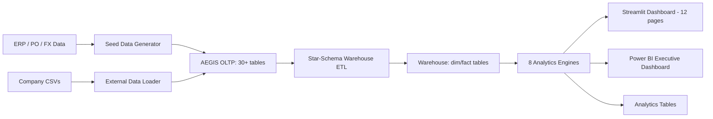

# AEGIS: Adaptive Engine for Global Intelligent Sourcing

A procurement intelligence platform built on a 40+ table MySQL schema, 8 analytics engines, and a 12-page Streamlit dashboard. It covers Monte Carlo simulation, ESG and carbon tracking, concentration analysis, should-cost modelling, and working capital optimization.

---

## What It Does

AEGIS brings together supplier scoring, risk quantification, FX simulation, cost benchmarking, and ESG compliance into one stack. The data flows from normalized OLTP tables through a star-schema warehouse into analytics output tables, all surfaced in a Streamlit dashboard and optionally in Power BI.

## Capabilities

- Multi-criteria supplier scoring (TOPSIS, PROMETHEE-II, WSM)
- 7-dimension composite risk scoring
- Monte Carlo simulation for FX, lead-time, disruption, and cost
- Carbon footprint tracking (GHG Protocol Scope 3, GLEC Framework)
- Spend concentration analysis (HHI across 5 dimensions)
- Should-cost modelling with automated leakage detection
- Working capital and early payment discount optimization
- Scenario planning: supplier switch, currency hedge, nearshoring
- ESG compliance and OECD 6-step due diligence tracking
- Interactive 12-page Streamlit dashboard

## Architecture Diagram



## Data Model

The database has three layers:

- **OLTP:** suppliers, materials, purchase_orders, po_line_items, shipments, invoices, quality_inspections, quality_incidents, contracts, fx_rates, commodity_prices, esg_assessments, carbon_estimates, compliance_checks, due_diligence_records (30+ tables)
- **Warehouse:** `dim_date`, `dim_supplier` (SCD Type 2), `dim_material`, `dim_geography`, `fact_procurement`, `fact_esg`
- **Analytics:** `supplier_scorecards`, `risk_assessments`, `concentration_analysis`, `simulation_runs`
- **Reference data:** 15 countries, 10 currencies, 12 ports, 7 incoterms, emission factors, certifications catalog

## Risk Score Formula

Composite Supplier Risk (7 dimensions):

$$
\text{Risk} = w_1 \cdot \text{Financial} + w_2 \cdot \text{Operational} + w_3 \cdot \text{Geopolitical} + w_4 \cdot \text{Compliance} + w_5 \cdot \text{Concentration} + w_6 \cdot \text{ESG} + w_7 \cdot \text{Cyber}
$$

Default weights: Financial (0.15), Operational (0.20), Geopolitical (0.15), Compliance (0.10), Concentration (0.15), ESG (0.15), Cyber (0.10). Each sub-score is normalized to $[0, 1]$ and the composite is mapped to risk tiers: Low ($< 0.3$), Medium ($< 0.6$), High ($< 0.8$), Critical ($\geq 0.8$).

## FX Monte Carlo Methodology

- Calculate daily log returns from historical FX rates
- Estimate drift ($\mu$) and volatility ($\sigma$) per currency
- Simulate $N = 10{,}000$ paths over 90 trading days using Geometric Brownian Motion
- Report P5, P25, P50 (median), P75, and P95 percentiles
- Compute Value at Risk (VaR) at the 95th and 99th percentiles

## HHI Concentration Methodology

Herfindahl-Hirschman Index across 5 dimensions (Supplier, Country, Currency, Material, Port):

$$
HHI = \sum_{i=1}^{N} s_i^2
$$

Where $s_i$ is market share percentage. Categories: Low ($< 1{,}500$), Moderate ($< 2{,}500$), High ($\geq 2{,}500$).

## Carbon Footprint Methodology

GHG Protocol Scope 3 Category 4 (upstream transport):

$$
\text{CO}_2\text{e (kg)} = \text{weight (tonnes)} \times \text{distance (km)} \times \text{emission factor}
$$

Emission factors (GLEC Framework v3): Sea (0.016), Air (0.602), Rail (0.028), Road (0.062) kgCO2e/tonne-km. Route distances are computed using the Haversine formula. The dashboard highlights mode-shift opportunities where switching from Air to Sea or Rail would cut emissions.

## What You Get

- Spend concentration, FX exposure, and ESG risk broken down by supplier, category, and geography
- 7-dimension risk scores with automated tier assignments
- Should-cost models with leakage flags at 5%, 15%, and 25% thresholds
- DPO analysis and an early payment discount optimizer that compares annualized returns
- GHG Scope 3 emissions per shipment, including mode-shift reduction opportunities
- Monte Carlo risk banding and what-if analysis for sourcing decisions

## Architecture

```
aegis-procurement/
├── config.py                      # Central configuration
├── run_aegis_pipeline.py          # Master orchestration script
├── streamlit_app.py               # Streamlit entry point
├── requirements.txt
├── Dockerfile / docker-compose.yml
│
├── database/                      # 10 SQL files, 40+ tables
│   ├── 00_MASTER_DEPLOY.sql       # Deploy orchestration
│   ├── 01-09 schema files         # OLTP, warehouse, analytics
│
├── data_ingestion/
│   ├── generate_seed_data.py      # 14-step realistic data generator
│   ├── populate_warehouse.py      # Star-schema ETL (SCD Type 2)
│   └── external_data_loader.py    # Import company CSV data
│
├── external_data_samples/         # Sample CSV templates
│   ├── suppliers.csv
│   ├── materials.csv
│   ├── purchase_orders.csv
│   ├── po_line_items.csv
│   ├── shipments.csv
│   ├── invoices.csv
│   └── esg_assessments.csv
│
├── analytics/                     # 8 engines
│   ├── mcda_engine.py             # TOPSIS, PROMETHEE-II, WSM
│   ├── monte_carlo.py             # FX (GBM), lead-time, disruption
│   ├── risk_scoring.py            # 7-dimension composite risk
│   ├── working_capital.py         # DPO, aging, EPD optimization
│   ├── should_cost.py             # Bottom-up cost, leakage flags
│   ├── carbon_engine.py           # GHG Protocol Scope 3, GLEC
│   ├── concentration.py           # HHI across 5 dimensions
│   └── scenario_planner.py        # Supplier switch, hedge, nearshore
│
├── pages/                         # 12 Streamlit pages
│   ├── 01_Executive_Dashboard
│   ├── 02_Supplier_Scorecards     # Interactive MCDA
│   ├── 03_Risk_Radar              # 7-dim heatmap
│   ├── 04_Monte_Carlo_Lab         # FX/Lead/Disruption/Cost sim
│   ├── 05_Concentration_Analysis  # HHI + treemaps
│   ├── 06_Carbon_Dashboard        # Scope 3 emissions
│   ├── 07_Should_Cost             # Cost decomposition + leakage
│   ├── 08_Working_Capital         # DPO + EPD optimizer
│   ├── 09_ESG_Compliance          # Ratings + OECD due diligence
│   ├── 10_Scenario_Planner        # What-if analysis
│   ├── 11_Data_Explorer           # Table browser + ad-hoc SQL
│   └── 12_Settings                # Config management
│
├── powerbi/                       # DAX measures, theme, build guide
├── tests/                         # 49 pytest tests
└── .github/workflows/ci.yml      # CI: test, lint, docker
```

## Quick Start

### Option A: Local (with existing MySQL)

```bash
cd aegis-procurement

# Create venv & install
python -m venv .venv
.venv\Scripts\activate       # Windows
pip install -r requirements.txt

# Run full pipeline (schema, seed, ETL, analytics)
python run_aegis_pipeline.py

# Launch dashboard
streamlit run streamlit_app.py
```

### Option B: External Company Data

```bash
# Import your own data instead of using sample data
python run_aegis_pipeline.py --external ./external_data_samples

# Or use the loader directly
python data_ingestion/external_data_loader.py --input-dir ./company_data
```

Place CSV files in a directory following the schema in `EXTERNAL_DATA_GUIDE.md`. Required files: `suppliers.csv`, `materials.csv`, `purchase_orders.csv`, `po_line_items.csv`. Optional: `shipments.csv`, `invoices.csv`, `esg_assessments.csv`.

### Option C: Docker

```bash
docker-compose up -d
# Dashboard at http://localhost:8501
```

## Notable Features

| Feature | Details |
|---------|-------------|
| TOPSIS + PROMETHEE-II | Two MCDA methods with interactive weight sliders |
| GBM Monte Carlo | 10,000-path Geometric Brownian Motion for FX risk |
| GHG Protocol Scope 3 | GLEC Framework emission factors with mode-shift analysis |
| SCD Type 2 Warehouse | Slowly-changing dimensions for supplier history |
| 7-Dimension Risk | Financial, operational, geopolitical, compliance, concentration, ESG, cyber |
| Should-Cost Model | Bottom-up cost decomposition with leakage flags |
| EPD Optimizer | Early payment discount arbitrage with annualized return comparison |
| HHI Analysis | Herfindahl-Hirschman across supplier, country, currency, material, port |
| OECD 6-Step DD | Due diligence tracking aligned to OECD guidance |

## Database

- MySQL 8.0 on localhost:3306
- Database name: `aegis_procurement`
- 40+ tables across OLTP, warehouse, and analytics layers
- Reference data: 15 countries, 10 currencies, 12 ports, 7 incoterms

## Analytics Engines

1. **MCDA** - Multi-criteria supplier scoring (TOPSIS, PROMETHEE-II, WSM)
2. **Monte Carlo** - Stochastic simulation for FX, lead-time, disruptions, cost
3. **Risk** - 7-dimension composite risk with configurable weights
4. **Working Capital** - DPO analysis, invoice aging, EPD optimization
5. **Should-Cost** - Bottom-up cost model with leakage detection
6. **Carbon** - GHG Scope 3 Category 4, haversine-based route emissions
7. **Concentration** - HHI analysis across 5 dimensions
8. **Scenario Planner** - Supplier switch, currency hedge, nearshoring what-ifs

## Testing

```bash
pytest tests/ -v
```

## Configuration (Environment Variables)

| Variable | Default | Description |
|----------|---------|-------------|
| `DB_HOST` | `localhost` | MySQL server host |
| `DB_PORT` | `3306` | MySQL server port |
| `DB_USER` | `root` | Database user |
| `DB_PASSWORD` | *(set in env)* | Database password |
| `DB_NAME` | `aegis_procurement` | Database name |
| `DATABASE_URL` | *(auto-built)* | Full SQLAlchemy connection URL |

All analytics parameters are configurable in `config.py`: FX volatilities and anchor rates (9 currencies), MCDA and risk weights, Monte Carlo defaults (paths, horizon), emission factors (sea/air/road/rail), HHI and cost-leakage thresholds.

## Production Notes

- Secrets come from environment variables (see `config.py`)
- Database constraints are enforced in the schema SQL files
- Test suite: `pytest tests/ -v` (49 tests)
- Docker deployment includes health checks
- CI/CD runs on GitHub Actions (test, lint, docker build)
- See `PRODUCTION_READINESS.md` for a full readiness checklist

## Deployment

- MySQL 8.0 must be running before the first pipeline run
- Run `python run_aegis_pipeline.py` to execute the 6-step pipeline (schema, seed, ETL, analytics, verify)
- For Docker: `docker-compose up -d` (dashboard at http://localhost:8501)
- See `PRODUCTION_READINESS.md` for production hardening steps
